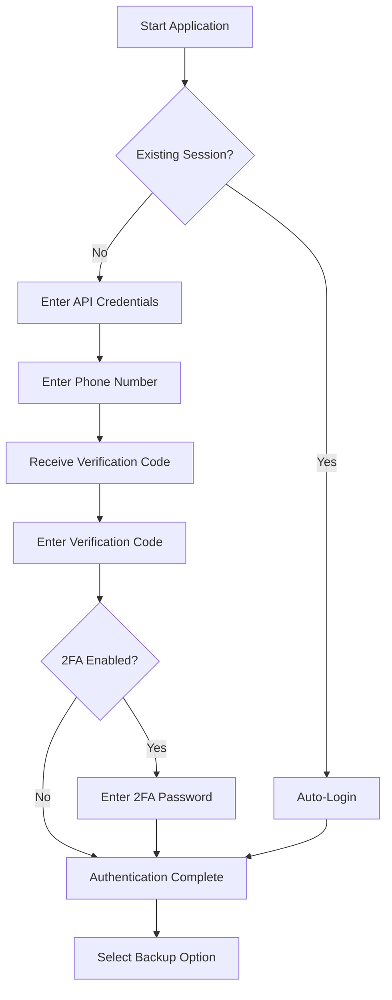
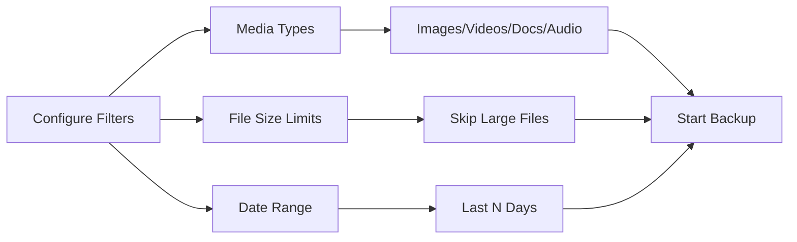
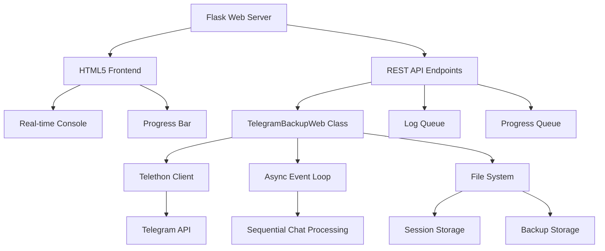

# 🚀 xsukax Telegram Backup

[](https://www.python.org/)
[](https://flask.palletsprojects.com/)
[](https://docs.telethon.dev/)
[](LICENSE)
[](https://github.com/xsukax/xsukax-Telegram-Backup)

A secure, self-hosted web application for backing up Telegram contacts and conversations with full control over your data. Features a GitHub-inspired dark theme UI with comprehensive filtering options.

## 🔒 Security & Privacy

**Complete Data Sovereignty**: This application prioritizes your privacy through local-only operation:

- **No Third-Party Services**: Direct connection to Telegram's official API without intermediaries
- **Local Storage**: All data (sessions, backups, media) stored exclusively on your machine
- **Session Persistence**: Encrypted session management via Telethon's secure session files
- **API Credential Control**: You maintain complete ownership of your Telegram API credentials
- **No Data Transmission**: Zero external data sharing or cloud uploads
- **Open Source**: Fully transparent codebase available for security auditing

## ✨ Features

- **Dual Contact Export Formats**: HTML (searchable web page) and VCF (phone import)
- **Comprehensive Chat Backup**: Message history with optional media downloads
- **Granular Media Filtering**: Selective download of images, videos, documents, and audio
- **Smart File Management**: Configurable size limits (skip files exceeding specified MB)
- **Date Range Control**: Backup messages from specific time periods
- **Quick Presets**: Text-only, Images-only, or Full backup configurations
- **Session Auto-Recovery**: Automatic reconnection with existing sessions
- **Real-time Progress**: Live console output and progress tracking
- **RTL Language Support**: Proper rendering for Arabic, Hebrew, and Persian scripts
- **Stable Sequential Processing**: Reliable chat processing without event loop conflicts

## 📋 Requirements

- Python 3.8 or higher
- Telegram API credentials (API ID and Hash from [my.telegram.org](https://my.telegram.org))
- Modern web browser

## 🚀 Installation

```bash
# Clone the repository
git clone https://github.com/xsukax/xsukax-Telegram-Backup.git
cd xsukax-Telegram-Backup

# Install dependencies
pip install flask flask-cors telethon

# Run the application
python xsukax-Telegram-Backup.py
```

The web interface will be available at `http://localhost:5000`

## 📖 Usage Guide

### Initial Setup

1. **Obtain API Credentials**
   - Visit [my.telegram.org](https://my.telegram.org)
   - Navigate to "API development tools"
   - Create an application to receive your API ID and Hash

2. **Launch Application**
   ```bash
   python xsukax-Telegram-Backup.py
   ```

3. **Open Web Interface**
   - Navigate to `http://localhost:5000` in your browser

### Authentication Flow



### Backup Options

#### 1. **Contacts Backup**

- **HTML Format**: Generates searchable web page with all contacts
- **VCF Format**: Creates standard vCard file for phone import

#### 2. **Chat Backup**

Configure backup parameters:



**Media Type Filters**:
- Images: `.jpg`, `.png`, `.gif`, `.webp`
- Videos: `.mp4`, `.mov`, `.avi`, `.mkv`
- Documents: `.pdf`, `.doc`, `.xls`, `.zip`, etc.
- Audio: Voice messages and audio files

**File Size Control**:
- Enable size limit to skip files exceeding specified MB
- Default: 50 MB (configurable up to 2000 MB)

**Date Range Filtering**:
- Backup messages from last N days (1-3650 days)
- Default: 180 days (6 months)

**Quick Presets**:
- **Text Only**: Fastest, messages without media
- **Images Only**: Text + image files
- **Full Backup**: Everything including large files

### Output Structure

```
xsukax_TB/
├── contacts_backup.html          # HTML contact list
├── contacts_backup.vcf            # VCF contact file
└── Chats/
    ├── ChatName1.html             # Chat conversation
    ├── ChatName2.html
    └── media/
        ├── ChatName1/
        │   ├── msg_12345.jpg
        │   └── msg_12346.mp4
        └── ChatName2/
            └── msg_78910.pdf
```

## 🔧 Technical Architecture



## 🛠️ Configuration

**Default Settings**:
- Server: `0.0.0.0:5000` (accessible on local network)
- Session File: `session_xsukax.session`
- Output Directory: `xsukax_TB/`
- Max File Size: 50 MB
- Date Range: 180 days

**Customization**: Modify variables in the `TelegramBackupWeb` class constructor or adjust filter parameters through the web interface.

## 🔐 Session Management

- Session files persist between runs for seamless re-authentication
- Encrypted using Telethon's built-in security mechanisms
- Automatic session validation on startup
- Manual logout: Delete `session_xsukax.session` file

## ⚠️ Important Notes

- **Rate Limits**: Telegram API has rate limits; excessive requests may result in temporary restrictions
- **Media Downloads**: Large media files may take considerable time depending on connection speed
- **Storage Space**: Ensure sufficient disk space before starting full backups with media
- **Network Stability**: Maintain stable internet connection during backup operations

## 📄 License

This project is licensed under the GNU General Public License v3.0.

## 🤝 Contributing

Contributions, issues, and feature requests are welcome. Feel free to check the [issues page](https://github.com/xsukax/xsukax-Telegram-Backup/issues).

## ⭐ Support

If you find this project useful, please consider giving it a star on GitHub!

---

**Disclaimer**: This tool is for personal backup purposes only. Users are responsible for complying with Telegram's Terms of Service and applicable data protection regulations.
